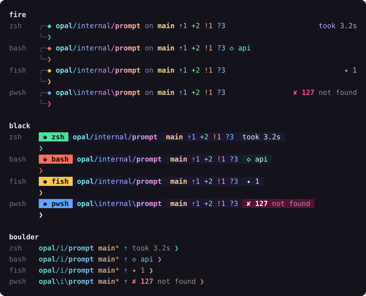

# opal

[](https://github.com/gjnail/opal/actions/workflows/ci.yml)
[](https://github.com/gjnail/opal/actions/workflows/terminal.yml)
[](https://ko-fi.com/gnail)

opal is a shell setup and a terminal of its own, sharing one config file.

The `opal` program sets up zsh, bash, fish and PowerShell on Windows, macOS
and Linux. Every shell gets the same prompt, aliases, tab completion,
suggestions and command history, written in that shell's own syntax.

[Opal Terminal](#opal-terminal) is opal's own terminal app. On Windows it
comes with its own bash, the way Git Bash does: [Opal Bash](#opal-bash) is
MSYS2's bash and Unix tools, set up with opal and kept apart from your other
shells. It also has tabs and split panes, inline images, quick select, and a
command palette that searches the history every shell writes. It runs on
Windows today. The macOS and Linux builds pass their tests in CI but haven't
been used on real machines yet.

**[Website](https://gjnail.github.io/opal/)** ·
**[Getting started](https://gjnail.github.io/opal/getting-started.html)** ·
**[Configuration](https://gjnail.github.io/opal/configuration.html)** ·
**[Plugins](https://gjnail.github.io/opal/plugins.html)** ·
**[FAQ](https://gjnail.github.io/opal/faq.html)** ·
**[Download](https://github.com/gjnail/opal/releases/latest)**



## What's in opal

| | What it does | Where |
|---|---|---|
| [Prompt](#prompt-and-themes) | Three themes, git status, command duration, exit codes, virtualenvs, SSH and root markers | all shells |
| [Aliases and plugins](#plugins) | Git aliases and other plugins, written once and translated into each shell's syntax | all shells |
| [Tab completion](#tab-completion) | Git branches, remotes and changed files; opal's own commands; completions generated by docker, kubectl, gh and other tools | all shells |
| [Suggestions](#suggestions) | Grey text completing what you type from history; Tab or Right arrow accepts it | fish, zsh, PowerShell with PSReadLine 2.1+, bash with [ble.sh](https://github.com/akinomyoga/ble.sh) |
| [Shared history](#shared-history) | One history for every shell, fuzzy-searched with Ctrl+R | all shells (bash 4+) |
| [Directory jumping](#directory-jumping) | `j proj` goes to the most used directory matching "proj" | all shells |
| [Tools](#commands) | `open`, clipboard, `extract`, `ports`, and `pkg install` for whichever package manager you have | all shells |
| [Opal Terminal](#opal-terminal) | A terminal app with tabs, splits, inline images, quick select, a palette over the shared history, session restore | Windows; macOS and Linux build but are untested |
| [Opal Bash](#opal-bash) | Opal Terminal's own bash, with `ls`, `grep`, `sed`, `awk`, `find`, `less`, `tar` and the other Unix tools, separate from your other shells | Windows |

See [Platform support](#platform-support) for what has been tested where.

## Install

On Windows, in PowerShell:

```
irm https://raw.githubusercontent.com/gjnail/opal/main/install/install.ps1 | iex
```

On macOS and Linux (and in Git Bash or WSL):

```
curl -fsSL https://raw.githubusercontent.com/gjnail/opal/main/install/install.sh | sh
```

The scripts download the latest release, check it against `SHA256SUMS.txt`,
put `opal` in `%LOCALAPPDATA%\opal\bin` or `~/.local/bin`, and run
`opal setup`. From a clone of this repository they build it with Go instead
(1.22 or newer, 1.24 or newer on macOS).

`opal setup` finds every shell on the machine and adds a small marked block
to each one's startup file: `.zshrc`, `.bashrc`, fish's `conf.d/opal.fish`,
and the profiles of Windows PowerShell and PowerShell 7 (including ones
OneDrive has moved). It keeps a `.opal-backup` of each file it changes and
imports your existing shell history. On Windows it offers to upgrade
PSReadLine when yours is too old for suggestions. Open a new terminal
afterwards; `opal doctor` shows what opal detected and which features are
on.

The scripts also install [Opal Terminal](#opal-terminal): on Windows to
`%LOCALAPPDATA%\opal\terminal` with a Start menu shortcut, on macOS to
`~/Applications/Opal Terminal.app`, and on Linux to `~/.local/bin` with a
menu entry. On Windows that includes Opal Bash. On Linux they skip it when
no graphical session is running, and on WSL and Termux. Set
`OPAL_NO_TERMINAL=1` (or pass `-NoTerminal` to `install.ps1`) to leave it
out. From a clone they build it when Go 1.26 is there; otherwise they
download it, which works with releases after 0.1.0. If that part fails, opal
itself stays installed.

### Checking a download

Each release has a `SHA256SUMS.txt` with the checksum of every archive, and
`opal update` refuses a download that doesn't match it. GitHub also keeps a
signed record that each archive was built from this repository by the
[release workflow](.github/workflows/release.yml). To check one with the
[GitHub CLI](https://cli.github.com/):

```
gh attestation verify opal_windows_amd64.zip --repo gjnail/opal
```

Opal Terminal's archives (`opal-terminal_windows_amd64.zip` and so on) have
their own `opal-terminal_SHA256SUMS.txt` and are attested the same way, by
the [terminal release workflow](.github/workflows/terminal-release.yml).

### Updating and removing

`opal update` installs the latest release, or pulls and rebuilds if you built
opal from a clone. It updates the `opal` program only; running the install
script again updates Opal Terminal, including Opal Bash.

To remove it, run `opal setup --remove`, which takes the marked blocks out of
your startup files. Then delete the program and its folders:

- the program: `%LOCALAPPDATA%\opal\bin` or `~/.local/bin/opal`. On Windows,
  also remove `%LOCALAPPDATA%\opal\bin` from your user PATH.
- the config: `~/.config/opal` on every system (`%USERPROFILE%\.config\opal`
  on Windows).
- the data: `%LOCALAPPDATA%\opal` on Windows, `~/.local/share/opal`
  elsewhere.
- Opal Terminal: `%LOCALAPPDATA%\opal\terminal` and the Start menu's
  Opal Terminal shortcut on Windows, `~/Applications/Opal Terminal.app` on
  macOS, and on Linux `~/.local/bin/opal-terminal`,
  `~/.local/share/applications/opal-terminal.desktop` and
  `~/.local/share/icons/hicolor/256x256/apps/opal-terminal.png`.

## Prompt and themes

```
opal theme preview        # all themes, as each shell would show them
opal theme set boulder    # takes effect at the next prompt
```

- fire: two lines, a gradient path, git status, and the duration and exit
  status on the right. The default.
- black: colored blocks, with the shell's name in the first one. Uses
  powerline separators if you have a Nerd Font.
- boulder: one line with a shortened path and compact git status.

Inside a git repository the path starts at the repository's folder. After the
branch come commits ahead and behind, then staged, modified and untracked
files, stashes, conflicts, and any rebase or merge in progress. The duration
appears after commands that take longer than two seconds, and the exit code
(with the signal name) after commands that fail. Python virtualenvs, background
jobs, and user@host over SSH, in containers or as root or administrator are
shown too.

The prompt symbol's color depends on the shell (green in zsh, red in bash,
gold in fish, blue in PowerShell), so it's always clear which one you're in.
zsh, fish and PowerShell redraw finished prompts as just that symbol, which
keeps scrollback short.

Themes are TOML files; copy one from
[internal/assets/themes](internal/assets/themes) into `~/.config/opal/themes/`
to make your own. A theme also sets the syntax colors of fish, PSReadLine and
zsh-syntax-highlighting, and the colors of Opal Terminal.

More on the website: [Themes](https://gjnail.github.io/opal/themes.html).

## Tab completion

Type `git checkout ` and press Tab to see your branches. The git aliases
complete the same way (`gco ` then Tab). zsh, bash and fish already complete
git; PowerShell doesn't, so opal adds it there, along with completion for its
own commands and aliases in every shell.

If docker, kubectl, gh, helm, uv, deno, pnpm, just or winget is installed,
opal also loads the completion script that tool generates. It's cached and
loaded the first time you press Tab after that command, so it doesn't slow
down starting a shell.

## Suggestions

Start typing a command you've run before and grey text shows the rest of it.
Tab or the Right arrow accepts it. The suggestions come from fish and
PSReadLine themselves, from opal's own engine in zsh (or zsh-autosuggestions
if you load it), and from ble.sh in bash when it's installed. In PowerShell,
Ctrl+Space opens the completion menu even while a suggestion shows, and F2
switches to a list of suggestions.

## Shared history

Every command from every shell goes into one history file. Ctrl+R opens a
full-screen search over all of it: type words in any order, pick one with the
arrow keys, and Enter puts it on your command line. Pressing Ctrl+R again
narrows the list to the current folder, then to the current shell.

Setup imports the history PowerShell, bash, zsh and fish already have.
Commands that start with a space aren't recorded, as in bash and zsh, and
`shared = false` under `[history]` stops recording entirely. The history file
is readable only by your account.

## Directory jumping

opal remembers the folders you visit. `j proj` goes to the folder you use
most whose path contains "proj", and `j work api` narrows it further. With
[fzf](https://github.com/junegunn/fzf) installed, `ji` lets you pick from a
list. Opal Terminal's command palette reads the same list.

## Plugins

Built in: `core`, `git`, `jump`, `python`, `node`, `docker`, `kubectl` and
`pkg`. `opal plugin list` shows which are active in the current shell.

A plugin is a TOML file. Plain strings work in every shell, and tables can
differ per shell and per OS:

```toml
name = "mine"
description = "My shortcuts"
requires = ["terraform"]            # skipped where terraform isn't installed

[aliases]
tf  = "terraform"
tfp = "terraform plan"
ll  = { unix = "ls -lh", pwsh = "Get-ChildItem" }

[functions.tfw]
sh   = 'terraform workspace select "$1"'      # bash and zsh
fish = 'terraform workspace select $argv[1]'
pwsh = 'terraform workspace select $args[0]'
```

Aliases become fish abbreviations, and PowerShell functions that pass on
arguments and pipeline input. PowerShell's own aliases, such as `gc` and
`gl`, are left alone unless you say otherwise.

Put a plugin in `~/.config/opal/plugins/`, or publish it as a git repository
and install it with `opal plugin install <user>/<repo>`. The
[plugin guide](https://gjnail.github.io/opal/plugins.html) covers the rest.

## Configuration

`~/.config/opal/config.toml` is read by every shell, on every OS, and by Opal
Terminal. `opal config edit` opens it; the file explains each setting. Your
own `[aliases]`, `[functions]` and `[env]` go there too and take precedence
over plugins. See the
[configuration reference](https://gjnail.github.io/opal/configuration.html).

## Commands

| Command | What it does |
|---|---|
| `opal doctor` | Shows what opal detected (OS, shell, terminal, colors) and which features are active |
| `opal setup` | Adds opal to every shell's startup file; `--remove` takes it out |
| `opal update` | Installs the latest release, or rebuilds from the checkout it was built from |
| `opal terminal` | Opens Opal Terminal in the current folder; `-profile NAME` picks the shell |
| `opal theme preview` / `set` | Shows every theme in every shell, or switches theme |
| `opal plugin list` / `install` / `update` | Manages plugins |
| `opal history` | The Ctrl+R picker; `opal history list 20`, `opal history import` |
| `opal open <path or url>` | Opens a file, folder or URL with the default app, including from WSL |
| `opal clip copy` / `paste` | Uses the system clipboard, or OSC 52 over SSH |
| `opal extract <archive>` | Unpacks zip and tar archives (and xz, zst, 7z, rar with the usual tools) into a new folder |
| `opal ports [port]` | Lists listening TCP ports and the processes behind them |
| `opal pkg install <name>` | Runs brew, apt, dnf, pacman, zypper, apk, winget, scoop or choco |

More on the website: [Commands](https://gjnail.github.io/opal/commands.html).

## Opal Terminal

Opal Terminal is opal's own terminal app, in [terminal/](terminal/). It's
written in Go on [Gio](https://gioui.org) with its own escape sequence parser
and screen model, and on Windows it comes with [Opal Bash](#opal-bash). It
reads the same `config.toml` as the prompt, takes its colors from the same
theme, and uses the command marks the prompt emits, so the two work as one
tool. It also runs any other shell or program; the shell integration
features need a prompt that emits OSC 133 marks, as opal's does.

It's developed and used on Windows. The macOS and Linux code builds and passes
its tests in CI on every change, but nobody has run it on a Mac or a Linux
desktop yet.

The keys below are the Windows and Linux defaults. macOS uses Cmd where they
use Ctrl+Shift, and every key can be changed.

### Opal Bash

On Windows, Opal Terminal comes with its own bash, the way Git for Windows
comes with Git Bash. It's the same MSYS2 bash and runtime that Git Bash is
built on, with the Unix tools you'd expect: coreutils (`ls`, `cp`, `mv`,
`cat`, `sort`, `wc` and the rest), `grep`, `sed`, `awk`, `find` and `xargs`,
`diff`, `less`, `tar`, `gzip` and `which`. New tabs open it unless `shell` in
`config.toml` names another shell.

It's kept apart from the rest of the machine:

- It starts with its own startup file, `shell/etc/opal/bashrc` in Opal
  Terminal's folder, instead of `~/.bash_profile` and `~/.bashrc`. That file
  loads opal, so the prompt, aliases, completion and Ctrl+R history are there
  without `opal setup` editing any startup file. Your own additions go in
  `~/.config/opal/bashrc`.
- Its up-arrow history is its own, in opal's data folder
  (`%LOCALAPPDATA%\opal\bash_history`). Ctrl+R still searches the commands of
  every shell.
- Nothing is added to your PATH, and PowerShell, Command Prompt, Git Bash and
  WSL stay as they were. Inside Opal Bash the bundled tools come first, then
  your Windows PATH, so `git`, `node`, `python` and other Windows programs
  work as usual.
- Drives are `/c`, `/d` and so on, `/tmp` is your Windows temp folder, and
  `~` is your Windows profile folder (or `HOME`, if you've set it), as in Git
  Bash.

The tools are MSYS2 packages, pinned by version and checksum in
[packages.lock](terminal/packaging/shell/packages.lock). MSYS2 builds them
for x64 only, so the ARM64 download has the x64 build, which Windows 11 on
ARM runs under emulation; that hasn't been tried yet. Their licenses (mostly
the GPL) are listed in the `shell/PACKAGES.txt` file that comes with them, and
each release has their source as `opal-terminal_shell-sources.tar`.

### Tabs and panes

- Tabs can be dragged to reorder, closed with a middle click, renamed, and
  duplicated.
- Panes split right, down, or along the longer side, with dividers you can
  drag or move from the keyboard. A pane can be zoomed to fill the tab.
- Broadcast mode sends what you type to every pane in the tab.
- New tabs can run any detected shell: Opal Bash, PowerShell 7, Windows
  PowerShell, Command Prompt, Git Bash and each WSL distribution on Windows,
  and the shells in `/etc/shells` elsewhere. Your own profiles (an ssh
  command, a shell with extra arguments, a working directory, environment
  variables) go in `config.toml`.

### Shell integration

With opal's prompt, the terminal knows where each command starts and ends:

- a mark in the gutter next to each command, colored by its exit status;
- Ctrl+Up and Ctrl+Down jump between prompts;
- Ctrl+Shift+E selects the last command's output, and the palette can copy it;
- clicking inside the command you're typing moves the shell's cursor there;
- when a command that ran longer than 10 seconds (configurable) finishes in a
  background tab or an unfocused window, the tab gets a note and you get a
  desktop notification. On Windows the taskbar button also flashes.

Since the terminal bundles the Nerd Font symbols, opal's prompt uses Nerd Font
icons inside it without any setup.

### Command palette, history and directories

Ctrl+Shift+P lists every action with its key, fuzzy-matched as you type.
Start the query with `!` to search opal's shared history from every shell
instead: Enter types the command at the prompt, Shift+Enter runs it.
Start it with `@` to list the directories `j` knows, most used first, and
Enter opens a new tab there. Ctrl+Shift+H and Ctrl+Shift+J open those two
lists directly.

### Quick select

Ctrl+Shift+Space puts a one- or two-letter label on every URL, path, git hash,
IP address, email address and UUID on screen. Typing a label copies that
match; typing it in uppercase also pastes it at the prompt. The labels start
on the home row.

### Find, selection and links

- Find in scrollback (Ctrl+Shift+F), with case and regex toggles.
- Select by character, word (double-click), line (triple-click) or block
  (Alt+drag). Copy on select is optional. Ctrl+C copies when text is
  selected and interrupts the program when nothing is.
- Ctrl+click opens links, both OSC 8 hyperlinks and plain URLs in the text.

### Inline images

Sixel, the kitty graphics protocol (chunked, compressed and file transfers,
placements and deletion) and iTerm2's `File=` sequence all work. Images
belong to the line they start on: they scroll, reflow and leave the
scrollback with their text. kitty's Unicode placeholders and animation aren't
done yet.

On Windows, the ConPTY built into the system drops the escape sequences
images use. The Windows release archives include Microsoft's newer
`conpty.dll` and `OpenConsole.exe`, and Opal Terminal uses them when they sit
next to the program. For a build of your own,
`terminal/scripts/fetch-conpty.ps1` puts them there.

### Text and colors

- Colors come from the opal theme, so the terminal matches the prompt.
  Individual colors and the 16-color palette can be overridden, and a minimum
  contrast setting lifts text that's hard to read on its background.
- Font fallback covers CJK, color emoji (COLR and PNG) and the Nerd Font
  icons the prompt uses. The icons are bundled, so nothing needs installing.
- Box drawing, block elements, braille, sextants and powerline separators are
  drawn from geometry instead of the font, so they line up without gaps at
  any size.
- The emulation follows xterm: scrollback that reflows on resize, true color,
  curly and colored underlines, grapheme clusters, bracketed paste, focus
  events, mouse reporting, the kitty keyboard protocol, synchronized output,
  and progress reports.

### Notifications and the clipboard

Programs can post desktop notifications with OSC 9, 99 and 777. They show as
toasts on Windows, in Notification Center on macOS, and through the
freedesktop notification service on Linux. By default they only appear when
the window isn't focused.

Programs may set the clipboard with OSC 52, which is how copying works over
ssh. Reading it is off by default, since any program you run, including on a
remote machine, could otherwise read what you last copied.

### Session restore

When you close the last window, its tabs, splits, shells, working directories
and up to 2000 lines of each pane's output are saved, and they come back on
the next launch with their command marks. Closing the last tab instead starts
fresh next time. `restore_session = false` turns this off.

### Settings

Ctrl+Comma (Cmd+Comma on macOS) opens a settings page for fonts, cursor,
colors, shell, scrollback, notifications, the clipboard and every
keybinding. Changes apply as you make them. They're written into the
`[terminal]` table of `config.toml` line by line, so your comments and the
rest of the file stay as they were. The
[terminal README](terminal/README.md#configuration) lists every setting and
default key.

### Building Opal Terminal

The [install scripts](#install) install it from the release archives, or
build it when run from a clone. To build it by hand, it needs Go 1.26 or
newer, and cgo on macOS and Linux (see
[Gio's install notes](https://gioui.org/doc/install/linux) for the Linux packages).

```
cd terminal
go build -ldflags=-H=windowsgui -o opal-terminal.exe .   # Windows
go build -o opal-terminal .                               # macOS and Linux
```

On Windows, run `scripts/fetch-conpty.ps1` in the same folder for image
support, and `go run ./tools/fetchshell` for Opal Bash, which downloads its
packages from MSYS2 and writes them to the `shell` folder the program looks
for next to itself. `opal-terminal -list-profiles` shows the shells it found,
`-profile NAME` starts one, and anything after the flags runs instead of a
shell (`opal-terminal htop`).

## Platform support

| | Windows | macOS | Linux |
|---|---|---|---|
| opal | Windows PowerShell 5.1 and Git Bash by hand; those and PowerShell 7 in CI | bash 3.2, zsh and PowerShell 7 in CI | bash 5, zsh, fish and PowerShell 7 in CI |
| Opal Terminal | Yes | Builds and passes tests in CI; not run on a Mac yet | Builds and passes tests in CI; not run on a desktop yet |
| Opal Bash | Yes (x64; the x64 build under emulation on ARM64, untested) | Not included; the system's shells are used | Not included; the system's shells are used |
| Inline images | Yes, with the newer ConPTY | Untested | Untested |
| Desktop notifications | Yes (toasts) | Untested (Notification Center) | Untested (freedesktop service or `notify-send`) |

opal is developed on Windows 11 with Windows PowerShell 5.1 and Git Bash. CI
runs the test suite on Windows, macOS and Linux and loads opal into each of
the shells above on every change. WSL counts as Linux. Reports from other
shells, terminals and systems are welcome.

## Privacy

opal and Opal Terminal run locally. There are no accounts, no analytics, and
nothing is sent anywhere. opal only goes online when you run `opal update`,
`opal plugin install` or `opal plugin update`, and on Windows when
`opal setup` offers to upgrade PSReadLine and you accept. Opal Terminal has no
network code. Building it from a clone downloads Opal Bash's packages from
MSYS2 (repo.msys2.org).

What they store:

- `~/.config/opal/`: `config.toml`, and your own themes and plugins.
- `%LOCALAPPDATA%\opal` on Windows, `~/.local/share/opal` elsewhere:
  `history.tsv` (the shared history), `jump.tsv` (remembered folders),
  caches for git status and tool completions, Opal Bash's `bash_history`,
  and Opal Terminal's `terminal-session.json`, which holds the recent output
  of each pane for session restore.

## How it works

### opal

opal is a single program. When a shell starts, `opal init <shell>` prints
code written for that shell, and each prompt calls opal to draw itself, so
nothing is emulated.

- bash 3.2 (macOS), 4.4 and 5.x all work. Command timing uses `PS0` and
  `EPOCHREALTIME` where they exist and is skipped on 3.2.
- In PowerShell, the init script is pure ASCII, and the prompt decodes opal's
  output as UTF-8, so glyphs survive Windows PowerShell's console code page.
- The prompt text is stored in a variable that the shell never expands again,
  so a directory named `$(rm -rf ~)` is displayed, not run.
- `git status` gets 200 ms by default. In a repository where it takes longer,
  the prompt shows the last known counts and updates them in the background.
- Colors fall back from truecolor to 256 and 16 colors, and glyphs from Nerd
  Font to plain Unicode to ASCII, depending on the terminal.
- The prompt emits OSC 133 command marks and OSC 7 working directory reports,
  which Opal Terminal, and other terminals that understand them, use for
  shell integration.

### Opal Terminal

The shell runs on a pseudo terminal: ConPTY on Windows, a Unix pty on macOS
and Linux. Its output goes through Opal Terminal's own parser into a screen
model with scrollback, which is separate from the window code and tested on
its own.

Each row of the screen is drawn into an image on the CPU, with glyphs from a
cache, and the rows are cached by their content, so scrolling only draws the
rows that are new. Gio composites the rows on the GPU and draws the cursor,
selection and search highlights over them. Drawing the text with Gio's own
GPU text paths was tried first and took about 60 ms a frame for a 200 by 60
screen.

On the development machine (AMD Ryzen 7 9800X3D), the parser takes in plain
text at about 228 MB/s and colored text with CJK characters at about
118 MB/s, and drawing a 200-column row takes about 31 µs. While a program
floods the terminal with output, a frame takes about 1.5 ms to build. To
measure on your machine:

```
cd terminal
go test -run '^$' -bench . ./internal/vt ./internal/render
```

See the [terminal README](terminal/README.md#layout) for the source layout.

### Opal Bash

Opal Bash is an MSYS2 root next to `opal-terminal.exe`, laid out the way Git
for Windows lays out Git Bash: `usr/bin` holds bash, the tools and
`msys-2.0.dll`, and `etc` holds the mount table, the account lookup settings
and Opal's startup file. Opal Terminal starts it as
`bash --noprofile --rcfile /etc/opal/bashrc -i`.

[tools/fetchshell](terminal/tools/fetchshell) builds it. `-update` resolves
the packages in `packages.txt`, and everything they depend on, against MSYS2's
package database and writes `packages.lock`. A build then downloads exactly
the files in the lock, checks each one's SHA-256 against it, and unpacks
them, leaving out manuals, translations, headers, and all but the common
terminal descriptions.

## Contributing

See [CONTRIBUTING.md](CONTRIBUTING.md). Please report security problems, such
as a way to make a shell run a command it shouldn't, privately as described
in [SECURITY.md](SECURITY.md).

Participation is covered by the [Code of Conduct](CODE_OF_CONDUCT.md).

## Support

opal is free. If it's useful to you and you'd like to say thanks, you can
support it at [ko-fi.com/gnail](https://ko-fi.com/gnail).

## License

[MIT](LICENSE).

Opal Terminal bundles Symbols Nerd Font Mono from the
[Nerd Fonts](https://github.com/ryanoasis/nerd-fonts) project, and a copy of
Gio v0.10.3 with a few input fixes; see the
[terminal README](terminal/README.md#third-party-files) for their licenses.
Opal Bash is made of [MSYS2](https://www.msys2.org) packages under their own
licenses, mostly the GPL, as described [above](#opal-bash).
